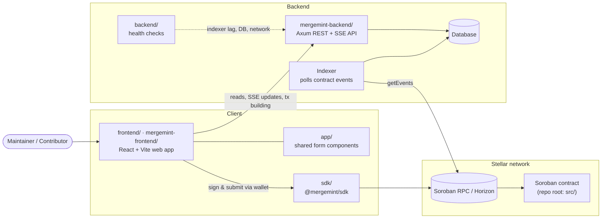

# MergeMint

MergeMint is an open-source bounty platform on [Stellar](https://stellar.org). Maintainers post
bounties for issues and escrow the reward on-chain. Contributors claim the bounties, and a verifier
approves the work, which releases the payout and builds the contributor's on-chain reputation.

This repository is a monorepo containing:

- the **Soroban smart contract**, the source of truth for bounties, escrow, disputes and reputation
- an **indexer + API backend** that mirrors contract events into a queryable store and builds transactions
- **web frontends** and a **TypeScript SDK** for talking to the contract

## Architecture



1. **Writes** (create, claim, complete, dispute) are Soroban contract invocations. The frontend
   uses the SDK (or XDR built by the backend's `/tx/*` routes), and the user signs with their
   wallet.
2. **Contract events** (`bounty_created`, `bounty_claimed`, `reward_paid`, …) are polled by the
   indexer in `mergemint-backend` and stored in the database.
3. **Reads** come from the backend API: paginated lists, assignee filters, and a Server-Sent
   Events stream that pushes bounty updates to open clients.

See [docs/architecture.md](docs/architecture.md) for contract data flow and storage layout.

## Repository layout

| Path                                         | What it is                                                                                           | Stack                              |
| -------------------------------------------- | ---------------------------------------------------------------------------------------------------- | ---------------------------------- |
| [`src/`](src/) ([`Cargo.toml`](Cargo.toml))  | The MergeMint Soroban contract: bounties, milestones, escrow, disputes, contributor reputation       | Rust, `soroban-sdk`                |
| [`mergemint-backend/`](mergemint-backend/)   | Event indexer and HTTP API (bounty lists, assignee filter, SSE stream, `/tx/*` transaction builders) | Rust, Axum, SQLx                   |
| [`backend/`](backend/)                       | Health-check endpoint logic (indexer lag, DB reachability, network passphrase validation)            | TypeScript                         |
| [`frontend/`](frontend/)                     | Main web app: bounty list/detail, create bounty, contributor profile, wallet connect                 | React, Vite, Vitest, Playwright    |
| [`mergemint-frontend/`](mergemint-frontend/) | Lightweight React frontend package used by the root npm workspace                                    | React, Vite, Vitest                |
| [`app/`](app/)                               | Reusable form components for the bounty and contributor flows (`@mergemint/app`)                     | React, TypeScript                  |
| [`sdk/`](sdk/)                               | Typed TypeScript SDK wrapping the contract's XDR interface (`@mergemint/sdk`)                        | TypeScript, `@stellar/stellar-sdk` |
| [`contracts/bounty/`](contracts/bounty/)     | Batch/parallel contributor-refresh prototype (see [docs/batch-refresh.md](docs/batch-refresh.md))    | Solidity                           |
| [`test/`](test/)                             | Hardhat tests for the batch-refresh prototype and bounty fixtures                                    | JavaScript                         |
| [`scripts/`](scripts/)                       | Deploy, smoke/integration tests, git hooks, [k6 load scenarios](scripts/k6/README.md)                | Bash, JavaScript                   |
| [`docs/`](docs/)                             | Design docs, guides and specs (index below)                                                          | Markdown                           |
| [`security/`](security/)                     | Write-ups of specific security checks enforced by the contract                                       | Markdown                           |
| [`.github/`](.github/)                       | CI workflows, Dependabot, issue and PR templates                                                     | GitHub Actions                     |
| [`.devcontainer/`](.devcontainer/)           | Dev container with the Rust toolchain preinstalled                                                   | Dev Containers                     |

## Quickstart

### Prerequisites

- Rust (stable) with the WASM target: `rustup target add wasm32-unknown-unknown`
- [Stellar CLI](https://developers.stellar.org/docs/tools/cli): `cargo install stellar-cli`
- Node.js 20+ (for the frontends, SDK and lint tooling)

Or open the repo in the provided [dev container](.devcontainer/devcontainer.json).

### Contract

```bash
make test     # run the contract test suite (no network needed)
make lint     # clippy (warnings as errors) + rustfmt check
make build    # build target/wasm32-unknown-unknown/release/mergemint_contracts.wasm
```

To deploy to testnet, follow [docs/getting-started.md](docs/getting-started.md) (create and fund a
key, then `make deploy`). `make bindings` generates TypeScript bindings into `sdk/generated/`.

### Backend

```bash
cd mergemint-backend
cargo run            # listens on http://localhost:8080
cargo test
```

### Frontend and SDK

```bash
npm install                  # root workspace + lint tooling
npm run dev:frontend         # start mergemint-frontend with Vite

cd frontend && npm install && npx vitest run   # main web app tests
cd sdk && npm install && npm run build         # build @mergemint/sdk
```

### Before your first commit

```bash
./scripts/install-hooks.sh   # runs fmt, clippy, eslint and prettier on staged files
```

See [CONTRIBUTING.md](CONTRIBUTING.md) for branch naming, the PR process, changelog rules and test
snapshots.

## Documentation

| Topic                                    | Doc                                                                        |
| ---------------------------------------- | -------------------------------------------------------------------------- |
| Getting started on testnet               | [docs/getting-started.md](docs/getting-started.md)                         |
| Contract architecture and storage layout | [docs/architecture.md](docs/architecture.md)                               |
| Event schema                             | [docs/event-schema.md](docs/event-schema.md)                               |
| Horizon / RPC polling in the indexer     | [docs/horizon-polling.md](docs/horizon-polling.md)                         |
| Integrations                             | [docs/integrations.md](docs/integrations.md)                               |
| Security model                           | [docs/security.md](docs/security.md)                                       |
| Pause and upgrade strategy               | [docs/pause-upgrade-strategy.md](docs/pause-upgrade-strategy.md)           |
| Escrow implementation plan               | [docs/escrow-implementation-plan.md](docs/escrow-implementation-plan.md)   |
| `create_bounty` parameter design         | [docs/create-bounty-params-design.md](docs/create-bounty-params-design.md) |
| Passkey authentication                   | [docs/passkey-auth.md](docs/passkey-auth.md)                               |
| Shared type generation                   | [docs/shared-type-generation.md](docs/shared-type-generation.md)           |
| Migrations                               | [docs/migration.md](docs/migration.md)                                     |
| Benchmarks                               | [docs/benchmarks.md](docs/benchmarks.md)                                   |
| Batch and parallel contributor refresh   | [docs/batch-refresh.md](docs/batch-refresh.md)                             |
| Backend load testing (k6)                | [scripts/k6/README.md](scripts/k6/README.md)                               |
| Contributor FAQ                          | [docs/contributor-faq.md](docs/contributor-faq.md)                         |
| SDK usage                                | [sdk/README.md](sdk/README.md)                                             |
| Changelog (contract interface)           | [CHANGELOG.md](CHANGELOG.md)                                               |
| Backend changelog                        | [mergemint-backend/CHANGELOG.md](mergemint-backend/CHANGELOG.md)           |

## Contributing

Contributions are welcome. Every PR should be tied to an issue, so start by opening or picking one
up, then read [CONTRIBUTING.md](CONTRIBUTING.md). If you think you've found a security issue in the
contract, read [docs/security.md](docs/security.md) first.
